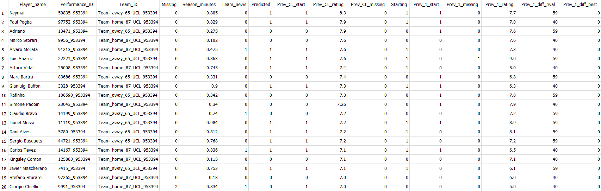
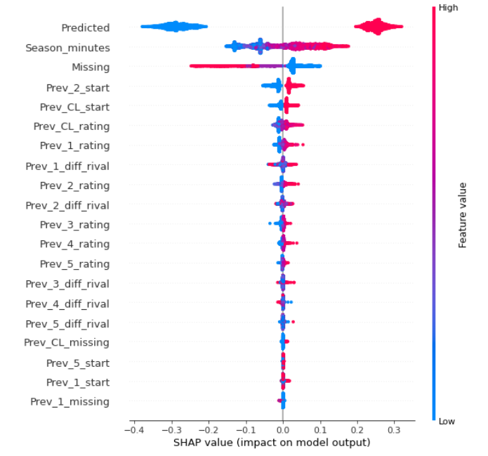

<!-- ABOUT THE PROJECT -->

# <b> Prediction of line-ups in UEFA Champions League matches </b>

## About the project

The purpose of this project was analyze of a machine learning use to predict of managerial decisions in football. With the use of public available data and machine learning algorithms I determined percentage chance of performance in starting squad for (almost) every player in UEFA Champions League for the years 2010-2020. The most of needed data was downloaded from WhoScored.com, one of the most popular football websites.

The project consisted of several mains stages (more information about each one may be found in the code and comments):
1. Downloading all necessary websites from WhoScored.com (and other) with the use of Python programming language and Selenium Webdriver.
2. Collecting data from the created html files with BeautifulSoup library and saving them into a local SQLlite database.
3. Analysis of collected data and determination of learning/testing dataset for machine learning algorithms.
4. Determination of the WhoScored.com effectiveness in typing of performances for players in UEFA Champions League.
5. Definition of the best values of parameters for several used machine learning algorithms resolving the descripted problem.
6. Running the machine learning algorithms (decision tree, random forrest, k-nearest neighbors, SVR) implemented in scikit-learn library.
7. Exploring of feature importance for attributes of used dataset based on several methods (Gini impurity, permutation importance, SHAP).
8. Choice of the most effective machine learning algorithm based on LogLoss function and comperition with the effevtiveness of WhoScored.com experts.

## Built With

* [Python 3.8.2](https://www.python.org/)
* [Selenium Webdriver 3.141.0](https://www.selenium.dev/documentation/webdriver/)
* [SQLite 3.28.0](https://www.sqlite.org/index.html)
* [BeautifulSoup 4.9.1 ](https://www.crummy.com/software/BeautifulSoup/bs4/doc/)
* [scikit-learn 0.24.2](https://scikit-learn.org/stable/index.html)

## Source Data
The project used historical data available on the Internet. The data about matches played in the UEFA Champions League and european leagues (predicted squads and players stats) was downloaded from <i> WhoScored.com </i>. Moreover, tha historical data about the tables in european leagues come from websites <i> footstats.co.uk </i> and <i> worldfootball.net </i>. HTML code of the websites was downloaded and saved as html files on the local disk with the use of Selenium Webdriver. In the next steps these files was analysied wit Beautiful Soup library to get the necessery data and insert them into a SQLite database. In the repository there are example downloaded html files (in the directories Matches and League_tables).

## Machine Learning Dataset

Learning and testing dataset for machine learning algorithms was the table with 33 attributes. Example data was shown below:

Descriptions and possible values of all 33 attributes look as following:

attribute/column | attribute description | possible values
--- | ---| --- |
Missing | defines if a player is on the list of players whose performance is doubtful or excluded  | 0 - available  1 - doubtful   2 - excluded 
Season_minutes | the ratio of played minutes to all possible minutes of a player in the current season | real number in the range <0; 1>
Team_news | defines if a player was included in the pre-match comments | 0 - absent   1 - present
Predicted | defines if a player was present in the predicted squad by WhoScored.com | 0 - absent   1 - present
Prev_CL_start | defines if  a player was included in the starting line-up in the last match of the UEFA Champions League | 0 - outside a squad   1 - present in the squad
Prev_CL_rating | score of a player in the last match of the Champions League (in the absence of a game - the score of the most difficult league match) | real number in the range <0; 10>
Prev_CL_missing | defines if a player was on the list of players whose performance was doubtful or excluded in the last match of the UEFA Champions League | 0 - available  1 - doubtful   2 - excluded 
Starting |  defines if a player is present in the line-up  | 0 - absent   1 - present
Prev_N_start | defines if a player was included in the basic squad in the last N-th league match (N = number from 1 to 5)  |  0 - outside a squad   1 - present in the squad
Prev_N_missing | defines if a player was on the list of players whose performance was doubtful or excluded in the last match of the UEFA Champions League | 0 - available  1 - doubtful   2 - excluded 
Prev_N_rating | score of a player in the last N-th league match (in case of no play - average score of  other league matches)| real number in the range <0; 10>
Prev_N_diff_rival | league table point difference between the player's team and a opposing team | integer (negative, positive, or zero)
Prev_N_diff_best | league table point difference between the player's team and a league leader | integer (negative, positive, or zero)

## Results

Analysis showed that WhoScored.com experts correctly predicted 82.54% of the performances for players in the UEFA Champions League matches.
[Function LogLoss](https://scikit-learn.org/stable/modules/generated/sklearn.metrics.log_loss.html) was used to compare the effectiveness of machine learning algorithms and WhoScored.com prediction.

<b>Algorithm </b>| <b> Value of LogLoss function </b> |
--- | --- | 
decision tree | 0.414
<b> random forrest </b> | <b> 0.390 </b>
k-nearest neighbors | 1.312 
SVR | 0.627
WhoScored.com predictions |0.506

The smaller the value of the function Log Loss, the better the effectiveness of algorithm. 
According to the results, the most effective machine learning algorithm to predict the probability of performances for football players is random forrest. 
Moreover, this method reached better score than WhoScored.com predictions.

After the indication of the most effective machine learning algorithm, the feature importance of used attributes was analysed. For this purposeI used three solutions: Gini impurity, permutation feature importance and SHapley Additive exPlanations. The result chart for [SHAP](https://shap.readthedocs.io/en/latest/index.html#) is shown below. According to the results, the most important features for the machine learning algotihm were the prediction of WhoScored.com experts and the percentage of played minutes of the footballer in a season.

### Disadventages of solution
This project isn't ideal and has several visible minuses. Most of all, the algorithms don't base on positions and dont't allow for a rivalship of footballlers for a slot in line-up. The percentage chance of performance is count for each player independently. Moreover, the determination of WhoScored.com effectiveness is only try, not exactly solution. This step allows to know a little more about my built solution and may be a benchmark for the project because probably the objective method of this calculation doesn't exist.
